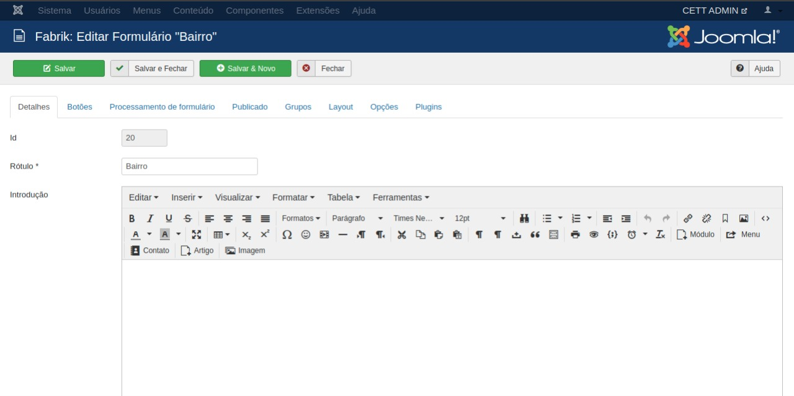
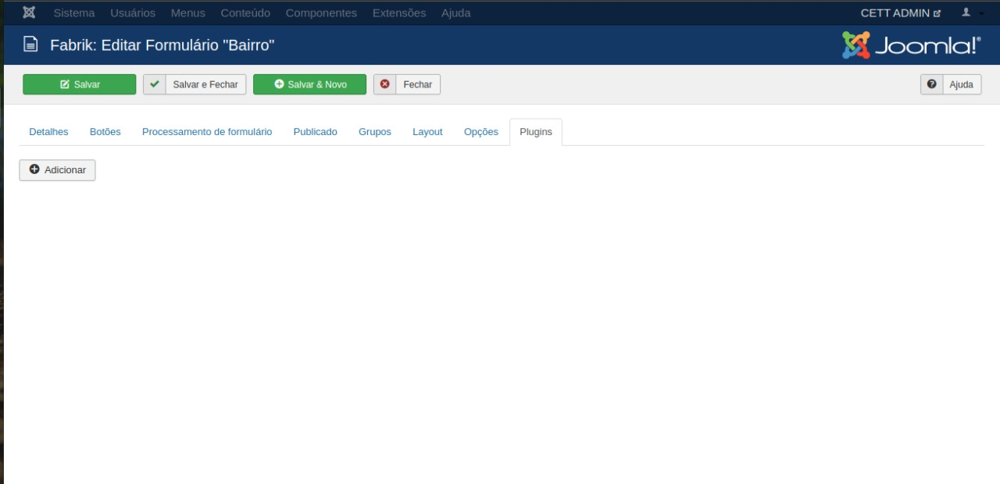
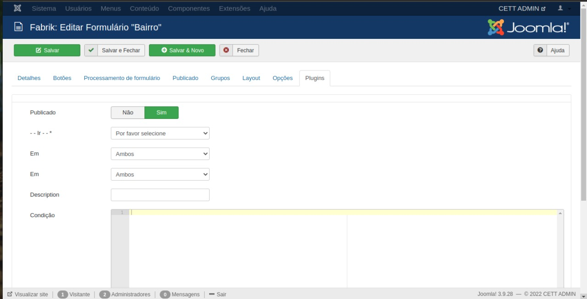
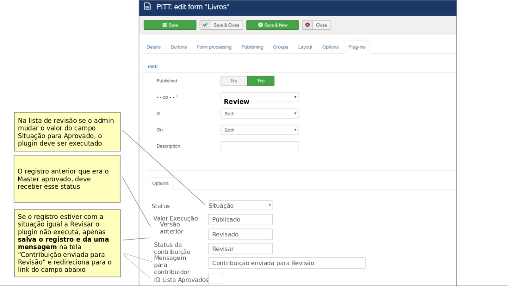
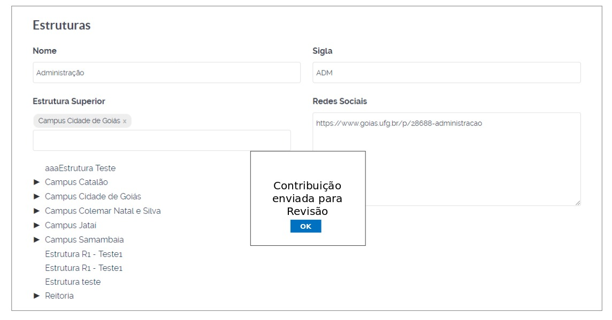

# Plugin Review

 

## Conteudo

- [Plugin](#plugin)
- [Colaboração em Banco de Dados](#colaboracao)

## Plugin

O plugin Review de Formulário. Como Usar e adicioná-lo ao formulário.

### Acesse ao formulário que deseja adicioná-lo e clique na aba "Plugin"

    

### Clique no botão "Adicionar"

    

### Configurações do Plugin

    

    <h1>Colaboração em Banco de Dados</h1>

- <b>Plugin Review ao ser executado:</b>
    - Copiar o id do registro master para o campo id_master
    - Muda a situação do registro master para Revisado
    - Substituir no registro master (original) seu ID por um novo ID (CUIDADO, FAZER ISSO ATRAVES DO SQL)
    - Substituir em todas as tabelas repeat os relacionamentos trocando o ID do registro que era master pelo novo ID
    - Substituir em todas as tabelas repeat os relacionamentos trocando o ID do registro candidato aprovado pelo ID_master
    - Substituir no registro candidato aprovado seu ID pelo ID_master (Apenas um update)

    

    

